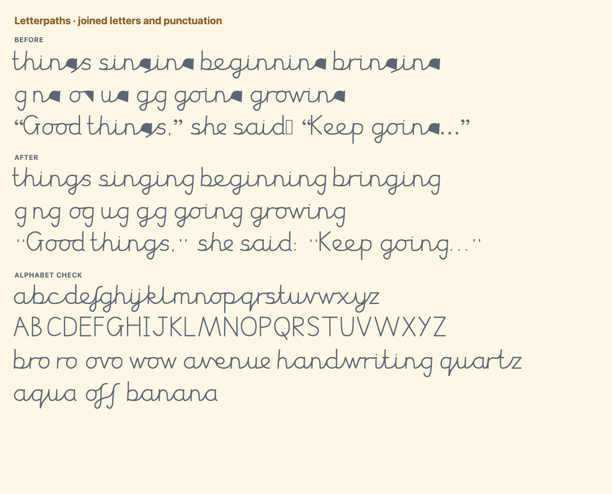

# Joined g outline repair (0.002)

The shipped font had six damaged outlines: `g.medi`, `g.fina`, `g.mediO`,
`g.finaO`, `g.mediU`, and `g.finaU`. These are the medial/final forms after
`n`, `o`, and `u`, explaining failures in words such as **things**, **going**,
and **bug**. The standalone `g` and the exported centerlines were correct.

## Cause and repair

The builder expanded centerlines into strokes, approximated Skia's conic
segments with cubics, then simplified overlaps with PathOps. At the nearly
coincident edges around the retraced stem of `g`, that order produced incorrect
filled regions. For example, `g.medi` lost its descender: the stroked path reached
y = -413.7, but the simplified outline stopped at y = -21.0. Its bowl also filled
in. Correct OpenType substitutions still selected this damaged glyph, so the
old shaping checks could not detect the problem.

The builder now simplifies the stroke with Skia **before** approximating its
native curves. It transfers the resulting fill rule to PathOps before normalizing
contour winding. Preserving that rule is essential: otherwise letters with
counters, such as `b` and `O`, can fill in. This general repair also makes the
previous `R`-specific contour-splitting workaround unnecessary.

## Other corrections

- Common punctuation now has recognizable outlines, including smart quotes,
  colon/semicolon, ellipsis, parentheses, brackets, asterisk, and angle operators.
- Fake mappings for digits and undrawn symbols were removed. Applications can
  select fallback glyphs instead of displaying the font's placeholder boxes.
- Vertical metrics now enclose all compiled outlines. Previously the Windows
  descent was 300 units while actual descenders reached 446 units. This could
  cause clipping in applications that use those metrics; see the
  [OpenType OS/2 specification](https://learn.microsoft.com/en-us/typography/opentype/spec/os2#uswindescent).
  Default line spacing may increase in applications that use font metrics.
- The font version is 0.002; generated OTF, TTF, WOFF2, the homepage copy, and its
  cache key are updated together. Asset synchronization also accepts an already
  current cache key, so repeating it succeeds.

## Validation

The outline verifier renders each of the 1,508 exported centerlines directly
with Skia's stroke renderer, then compares that image with the corresponding
compiled glyph. It counts both missing and extra ink, using a 4% tolerance for
coordinate rounding and cubic-to-quadratic conversion. The original OTF fails on
exactly the six `g` forms above, with 111–145% differing ink. The repaired fonts
pass in OTF, TTF, and WOFF2; the worst difference is below 3%.

Each output format also passes 19,747 HarfBuzz probes, covering all lowercase
pairs and triples, all capital-to-lowercase pairs, punctuation boundaries, mixed
case, the reported words, and disabled contextual alternates. Checks fail the
build on a mismatch. Browser specimens include the repaired words, all letters,
common punctuation, and unsupported characters using fallback fonts.
